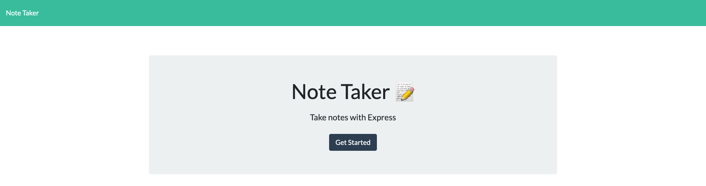
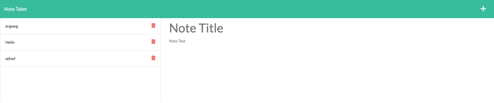

# To-Do-List-Express

[](https://opensource.org/licenses/MIT)


## Table of Contents

* [Description](#description)
* [Learning Points](#learning-points)
* [Installation](#installation)
* [Credits](#credits)
* [Questions](#questions)
* [Tests](#tests)
* [License](#license)

## Description

[Link to Deployed Site on Heroku](https://to-do-list-express-9a349a9545e8.herokuapp.com/)




The goal of this project was to use express to create a functional server on the backend of a To Do List App. We were given the entire front end so this project ONLY focues on back-end Development. I first started with creating folders and files for the routes that we I was going to use. I knew that we would need routes to the two html pages given to us in the start code, as well as routes to the API (which was the database given to us called db.json).  After getting all the routes working, I had to add HTTP commands such as GET, POST and DELETE in order to allow the user to interact with the page. This part was very hard for me but I eventually got it with the help of my tutor (Chris Baird).  


## Learning-Points

The page initially worked when you opened it, it would go to a page (index.html) that had one button that said get started.  After that there was a disconnet to the other page.  Conceptually I understood what needed to be done, but as im learning, writing concepts in code proves to be hard. There were many learning points in the challange for me. One of them being ROUTING, which i totally understand conceptually but was lost when it came time to ROUTE. I initially avoided it, and wrote most of my code in the server.js. I was able to get note.html page to show up and was able to POST to the page as well. When I started to ROUTE I realized that I did not make a index.js file to flag the end points in the HTTP to send requests to either my apiRoute of htmlRoute.  With that file, I could work on each route file I had created. The error I had here was how I wrote the files to direct the user to the propper html page. 

```S

router.get("/notes", (req, res) =>
   res.sendFile(path.join(__dirname, "../public/notes.html"))
);


router.get("*", (req, res) =>
   res.sendFile(path.join(__dirname, "../public/index.html"))
);

```

Initially I did not have "../public/notes.html, since i had been working out of my serve.js. Now when checked my code on my localserver it wasnt working. It is because I moved the file path to another folder and did not change the path to match its movement.  This took me a long time to figure out and was such a simple fix. I was sure I messed up my code somehow but am happy I gained knowledge from this mistake.

## Installation

User MUST have Node.js and NPM Express installed.


## Credits

I would like to thank my fellow classmates, my tutors, teaching staff and my family for all the support through out this program.

## Questions

If you have any further questions please contact me.

- Name: Thomas Munzar
- Email: tmunzar92@gmail.com
- Github: [ThomasMunzar](https://github.com/ThomasMunzar/)

## Contributing

n/a

## Tests
n/a